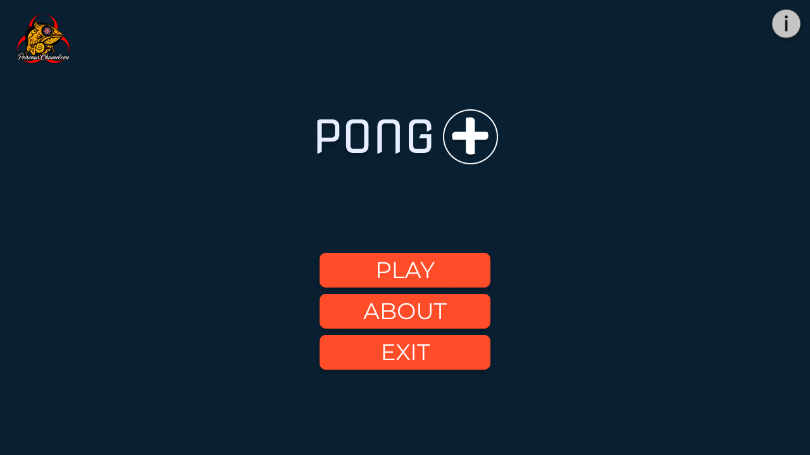

<div align="center">

<h1> Pong Plus by Perguruan Bunglon Beracun </h1>

Pong Plus is a pong game created by Perguruan Bunglon Beracun.


[](#)
[](#)
[](https://github.com/n0l3r/Pong-Plus/issues)
[](#)
[](#)
</div>


# Table of Contents
[Contributing](#members-of-the-team)

[Introduction Game](#introduction-game)

[Installation Steps](#💻installation-steps)

[Running the Game with Docker](#running-the-game-with-docker)

[Running the Game with Python](#running-the-game-with-python)

[Screenshots](#screenshots)

## Members of the Team
<div align="center">

| Name | NIM | Role | Github|
| :---: | :---: | :---: | :---: |
| Naufal Taufiq Ridwan     | 120140044 | Project Manager + Programmer | [n0l3r](https://github.com/n0l3r) |
| Andre Riatasa Wijaya     | 120140166 | Programmer | [PoohNoCounter](https://github.com/PoohNoCounter)    |
| M. Herton Amarta Buana   | 120140182 | Programmer | [HrtnZx](https://github.com/HrtnZx) |
| Vinsensius Robby Anggara | 120140192 | Designer | [vinsensiusrobby15](https://github.com/vinsensiusrobby15) |
| Afif Syaifullah Fattah   | 120140229 | Programmer | [AfifSaifullah](https://github.com/AfifSaifullah) |
| Yusuh Hafidz             | 120140234 | Designer + Programmer | [hfdzz](https://github.com/hfdzz) |

</div>

## Inroduction Game
Pong Plus is a two dimensional game that
played by two players. Rule of the game
similar to the classic game pong, which is a ball
will be thrown from the middle of the board and every player
can bounce the ball with a paddle that
are on the left and right of the game board.
This game is played by two players who compete.

## Installation Steps
<li> Install Python 3.6 or higher</li>
<li> Install python-pip or python3-pip</li>
Open terminal where you want to clone the repository and run the following command:

```
git clone https://github.com/n0l3r/Pong-Plus.git
cd Pong-Plus
pip install -r requirements.txt
```

## Running the Game with Docker
<li> Install Docker </li>

Run the following command to start the game:

```
chmod +x docker-run.sh
./docker-run.sh
```

or run the docker command directly:

```
docker build -t pong-plus .
xhost +
docker run --rm -e DISPLAY=$DISPLAY \
           -v /dev/snd:/dev/snd \
           -v /tmp/.X11-unix/:/tmp/.X11-unix/ \
           --privileged \
           --name pong-plus pong
```

## Running the Game with Python
<li> Install Python 3.6 or higher</li>
Run the following command to start the game:

```
python3 main.py
```
alternative command:

```
python main.py
```

## Screenshots





## Video run with Docker
[](https://www.youtube.com/watch?v=p2YXdauOEM0)


